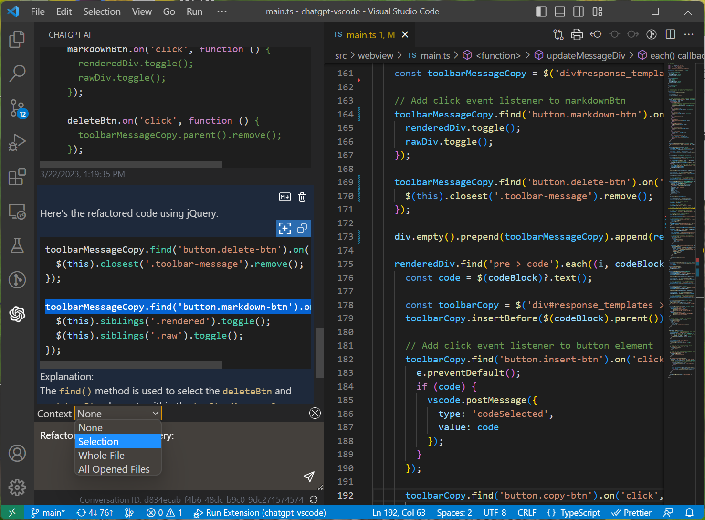

# ChatGPT Logger *(Research Puepose)*

ChatGPT AI Extension integrates OpenAI's GPT-4, GPT-3.5, GPT-3 and Codex models into Visual Studio Code, providing AI-powered assistance for writing new code, asking questions, finding bugs, refactoring code, and more.

 

 

## Features
- 💡 **Ask general questions** or use code snippets from the editor to query ChatGPT via an input box in the sidebar.
- 💬 **View chat history** with requests and responses.
  - Toggle the display of requests and responses between rendered Markdown and raw text.
  - 📝 **Insert code snippets** from the AI's response into the active editor with corrected indentation.
  - 📋 **Copy code snippets** to the clipboard.
- 📚 **Multiple types of context** available:
  - ❌ No context.
  - 📝 Selected text.
  - 📂 Whole file.
  - 📂🔍 All opened files.
- 🖱️ Right-click on a code selection and run one of the context menu **shortcuts** for your code:
  - 📖 Automatically generate documentation.
  - 🤔 Explain the selected code.
  - ♻️ Refactor or optimize the code.
  - 🐛 Find problems with the code.
  - 💻 Complete the code according to the comments.
- 🚀 See the response as it is being generated **in real time**.
- 💬 Ask **follow-up questions** to the response and maintain conversation context.

## TODO:
- [ ] Add Event Logger, refer to [VSCode extension logger](https://github.com/ryanyen2/vscode-logger-extension)
  - [ ] create log file
  - [ ] stream log to the file
  - [ ] define the log event structure
- [ ] release the tool to the marketplace (private)

## Requirements
To use ChatGPT AI, please ensure that the following requirements are met:

* Visual Studio Code version 1.73.0 or later is installed on your system.
* You have an OpenAI API key or ChatGPT access token.

## Installation

To use this extension, install it from the VSCode marketplace.

1. After the installation is complete, you will need to add your OpenAI API key to the extension settings in VSCode. To do this, open the `Settings` panel by going to the `File` menu and selecting `Preferences`, then `Settings`.
2. In the search bar, type `ChatGPT` to filter the settings list.
3. In the ChatGPT section, enter your API key in the top field

After completing these steps, the extension should be ready to use.

## API Modes

Currently, there are two modes for accessing the API: "ChatGPTAPI" and "ChatGPTUnofficialProxyAPI".
### ChatGPTAPI

To use this extension, you will need an `API key` from OpenAI. To obtain one, follow these steps:

1. Go to [OpenAI's website](https://platform.openai.com/account/api-keys). If you don't have an account, you will need to create one or sign up using your Google or Microsoft account.
2. Click on the `Create new secret key` button.
3. Copy the key and paste it into the `API Key` field in the extension settings.

### Setup

### Reference:
- credit to **[Github Repository](https://github.com/yaleh/chatgpt-vscode)**
- [ChatGPT VSCode Extension](https://github.com/ismailkasan/chat-gpt-vscode-extension)
- [ScribeAI](https://github.com/ajikan/ScribeAI)
- [ChatGPT Helper](https://github.com/kiranvshah/chatgpt-helper) 
